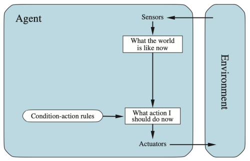
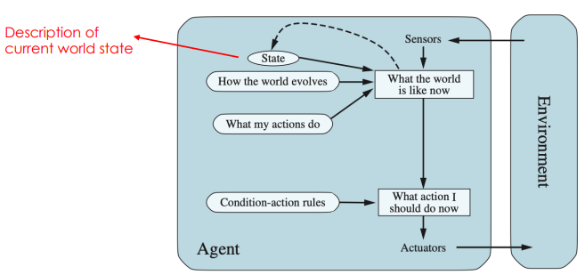

# Lesson 2

- [Lesson 2](#lesson-2)
  - [**Intelligent Agents**](#intelligent-agents)
    - [<u>Artificial Intelligence</u>](#uartificial-intelligenceu)
    - [<u>AI strategies</u>](#uai-strategiesu)
    - [<u>Intelligent Agents</u>](#uintelligent-agentsu)
    - [<u>Agent function</u>](#uagent-functionu)
    - [<u>Agent Interaction</u>](#uagent-interactionu)
    - [<u>Ex: The vaccum-cleaner agent</u>](#uex-the-vaccum-cleaner-agentu)
    - [<u>Performance measure</u>](#uperformance-measureu)
    - [<u>Rational agents</u>](#urational-agentsu)
    - [<u>Task environment</u>](#utask-environmentu)
    - [<u>Environment types I</u>](#uenvironment-types-iu)
    - [<u>Environment types II</u>](#uenvironment-types-iiu)
    - [<u>Environment types III</u>](#uenvironment-types-iiiu)
  - [**Agent Types**](#agent-types)
    - [<u>Reflex agent</u>](#ureflex-agentu)
    - [<u>Model-based reflex agent</u>](#umodel-based-reflex-agentu)
    - [<u>Model-based, Goal-based agent</u>](#umodel-based-goal-based-agentu)
    - [<u>Model-based, utility-based agent</u>](#umodel-based-utility-based-agentu)
    - [<u>General learning agent</u>](#ugeneral-learning-agentu)
  - [Summary](#summary)

 
 
<!-- pagebreak -->

## **Intelligent Agents**

### <u>Artificial Intelligence</u>

- A branch of computer sciencce dealing with the simulation of intelligent behaviour in computers.
- The capablity of a machine to imitate intelligent human behaviour.

### <u>AI strategies</u>

- Think aas a human: the **cognitive model**.
- **Rational thinking:** to draw justifable concludions from data, rules, and logic.
- Rational acting: **intelligent agents**.

### <u>Intelligent Agents</u>

An **agent** is anything that can be viewed as **perceiving** its environment through **sensors** and **acting** upon that environment through **effectors**.

A **rational agent** is one that does the "right thing". We use the term _performance measure_ for the how the criteria that determine how successful an agent is.

A definition of **artificial intelligence research:** "The study and design of rational agents"

### <u>Agent function</u>

The agent function maps from perception to actions:
$f$: $P$ → $A$
The agent program runs on the physical architecture to
produce **$f$**  
Agent = Architecture + Program

### <u>Agent Interaction</u>

 

### <u>Ex: The vaccum-cleaner agent</u>

A vacuum-cleaner world with just two locations. Each location can be clean or dirty, and the agent can move left or right and can clean the square that it occupies:

- Percepts: location, contents – e.g., $[$ A, dirty $]$
- Actions: ${$ left, right, suck, noOp $}$

  

Partial tabulation of a simple agent function for the vacuumcleaner world. The agent cleans the current square if it is dirty, otherwise it moves to the other square.

### <u>Performance measure</u>

An objective criterion for success of an agent's behaviour (“cost”, “reward”, “utility”, “sustainable”…).

E.g., performance measure of a vacuum-cleaner?

- amount of time taken
- amount of dirt cleaned up
- amount of electricity consumed
- world cleaned?
- ...

### <u>Rational agents</u>

**Rational Agent**: For each possible percept sequence, a rational agent should select an action that is expected to _maximize_ its performance measure, based on the evidence provided by the percept sequence and whatever built-in knowledge the agent has.  
Rationality is distinct from omniscience (all-knowing with infinite knowledge).  
Agents can perform actions in order to modify future perceptions so as to obtain useful information (exploration).  
An agent is **autonomous** if its behaviour is determined by its own perceptions & experience (with ability to **learn** and  adapt) without depending solely on build- in knowledge.

### <u>Task environment</u>

To design a rational agent, we must specify the task environment **P.E.A.S.**:

- Performance measure
- Envirnoment conditions
- Actions allowed
- Sensors for perception

Example table:  
  

### <u>Environment types I</u>

- Fully observable (vs. partially observable): an agent's sensors give it access to the complete state of the environment at each point in time.
- Deterministic (vs. stochastic): The next state of the environment is completely determined by the current state and the action executed.
by the agent. (If the environment is deterministic except for the actions of other agents, then the environment is strategic)
- Episodic (vs. sequential): An agent’s action is divided into atomic episodes. Decisions do not depend on previous decisions/actions.

### <u>Environment types II</u>

- Static (vs. dynamic): the environment is unchanged while an agent is deliberating. (The environment is semidynamic if the environment itself does not change with the passage of time but the agent's performance score does)
- Discrete (vs. continuous): a limited number of distinct, clearly defined perceptions and actions. How do we represent or abstract or model the world?
- Single agent (vs. multi-agent): an agent operating by itself in an environment. Does the other agent interfere with my performance measure?
 

### <u>Environment types III</u>

- Ideal environment:
  - Fully
  - Deterministic
  - Episodic
  - Static
  - Discrete
  - Single
- Real environment:
  - Partially
  - Stochastic
  - Sequential
  - Dynamic
  - Continuous
  - Multi-agent

## **Agent Types**

Five basic types in order of increasing generality:

- Table Driven agents
- Simple reflex agents
- Model-based reflex agents
- Goal-based agents
- Utility-based agents

### <u>Reflex agent</u>

 

  
 

We use rectangles to denote the current internal state of the agent’s decision process, and ovals to represent the background information used in the process.

 

  

Will work only if the correct decision can be made on the basis of only the current percept—that is, only if the environment is fully observable.

### <u>Model-based reflex agent</u>

 

Model the state of the world by: modelling how the world changes how its actions change the world. This can work even with partial information.

### <u>Model-based, Goal-based agent</u>

 

It keeps track of the world state as well as a set of goals it is trying to achieve, and chooses an action that will (eventually) lead to the achievement of its goals.  
We need to predict: plan & search.

### <u>Model-based, utility-based agent</u>

 

It uses a model of the world, along with a utility function that measures its preferences among states of the world. Then it chooses the action that leads to the best expected utility, where expected utility is computed by averaging over all possible outcome states, weighted by the probability of the outcome.

### <u>General learning agent</u>

 

The “performance element” box represents what we have previously considered to be the whole agent program. Now, the “learning element” box gets to modify that program to improve its performance.

## Summary

- **Agent** is anything that can be viewed as **perceiving** and **acting**
- **Performance measurement** evaluates the agent behaviour, and a **rational agent** maximizes this measure
- **Environment** types and problem description (P.E.A.S.)
- The **Agent program**: Reflex, Model-based, Goal-based, Utilitybased and General (learning)
