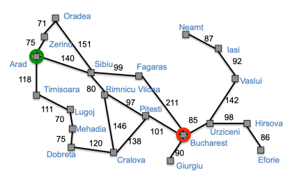
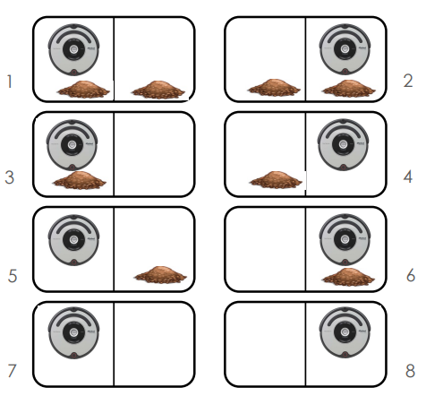
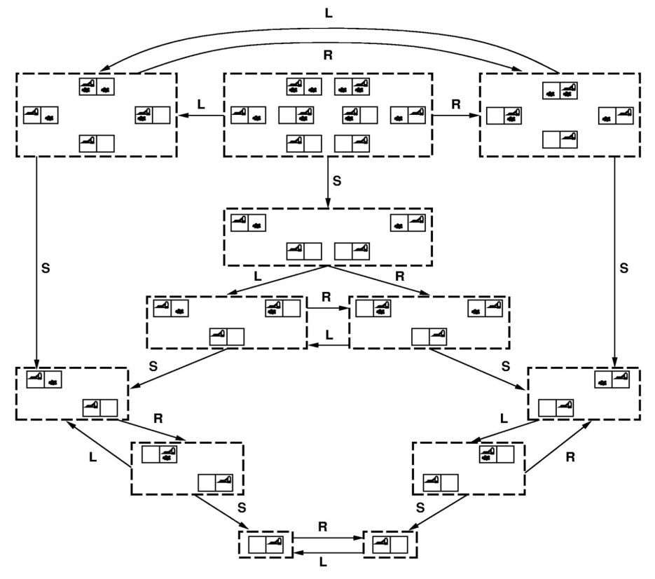

# Lesson 3

- [Lesson 3](#lesson-3)
  - [Goal-based agents](#goal-based-agents)
  - [Why search?](#why-search)
  - [Problem-solving agents](#problem-solving-agents)
    - [**Goal formulation:**](#goal-formulation)
    - [**Problem formulation:**](#problem-formulation)
  - [Environment](#environment)

 
 

### Goal-based agents

- Have a concept of the future
- Can consider impact of action on future states
- Capable of comparing desirability of states relative to a goal
- Agent’s job: identify best course of actions to reach goal
- Can be accomplished by searching through possible states and actions

**An example:**
If you want to go on a trip:
 

  

- First goal:
  - Go to the airport..
- Formulate problem:
  - States: different roads
  - Actions: drive between roads / choose next road
- Find a solution:
  - Requence of roads

### Why search?

- **Why not Dijkstra's Algorithm?**
  - Want to search in unknown & infinite spaces Combine search with “exploration” (Ex: autonomous rover on Mars must search an unknown space)
  - Want to search based on agent’s actions, w/ unknown connections
(Ex: web crawler may not know what connections are available on a URL before visiting it)
  - The agent may not know the result of an action before trying it

### Problem-solving agents

These are the following steps which require to solve a problem:

#### **Goal formulation:**

This one is the first and simple step in problem-solving. It organizes finite steps to formulate a target/goals which require some action to achieve the goal. Today the formulation of the goal is based on AI agents.

- Agent creates goal based on:
  - Current environment
  - Evaluation metrics
- How does a goal help?
  - Guidance when state is ambiguous
  - Narrows down potential choices

#### **Problem formulation:**

It is one of the core steps of problem-solving which decides what action should be taken to achieve the formulated goal. In AI this core part is dependent upon software agent which consisted of the following components to formulate the associated problem.

- A **state** is a representation of problem elements at a given moment.
- A **State space** is the set of all states reachable from the **initial state**.
- A state space forms a graph in which the nodes are states and the arcs between nodes are **actions**.
- In fact, the initial state and the actions define the state space.

**An exammple: the vaccum model:**
 

  

- States:
  - location, dirt
- Actions:
  - left, right, suck
- Goal:
  - celean world

State space graph:
 

  

### Environment

- **Observable** / Partially: know the initial state
- **Static** / Dynamic: the states don’t change when the agent search
- **Deterministic** / Stochastic: the next state is defined only by current
- **Discrete** / Continuous: time management
