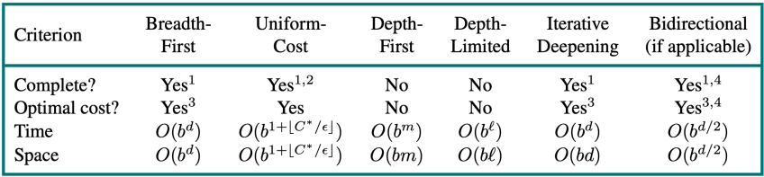

# Lesson 3

- [Lesson 3](#lesson-3)
  - [Goal-based agents](#goal-based-agents)
    - [Why search?](#why-search)
    - [Problem-solving agents](#problem-solving-agents)
      - [**Goal formulation:**](#goal-formulation)
      - [**Problem formulation:**](#problem-formulation)
  - [Environment](#environment)
    - [State space search](#state-space-search)
    - [Tree search](#tree-search)
  - [Search strategies](#search-strategies)
    - [Summary](#summary)
    - [Performances measures of search](#performances-measures-of-search)
  - [Uninformed search](#uninformed-search)
    - [Uninformed search strategies](#uninformed-search-strategies)
    - [**Breadth-first search**](#breadth-first-search)
    - [**Depth-first search**](#depth-first-search)
    - [**Depth-limited search**](#depth-limited-search)
    - [**Iterative deepening search**](#iterative-deepening-search)
  - [Informed search](#informed-search)
    - [Heuristics](#heuristics)
    - [**Best first search**](#best-first-search)
    - [**Greedy search**](#greedy-search)
    - [**A* search**](#a-search)
      - [Properties of A* search](#properties-of-a-search)
    - [Admissible heuristics](#admissible-heuristics)
    - [Consistent heuristics](#consistent-heuristics)
    - [Particular cases](#particular-cases)
    - [Summary](#summary-1)

 
 

## Goal-based agents

- Have a concept of the future
- Can consider impact of action on future states
- Capable of comparing desirability of states relative to a goal
- Agent’s job: identify best course of actions to reach goal
- Can be accomplished by searching through possible states and actions

**An example:**
If you want to go on a trip:
 

  

- First goal:
  - Go to the airport..
- Formulate problem:
  - States: different roads
  - Actions: drive between roads / choose next road
- Find a solution:
  - Requence of roads

### Why search?

- **Why not Dijkstra's Algorithm?**
  - Want to search in unknown & infinite spaces Combine search with “exploration” (Ex: autonomous rover on Mars must search an unknown space)
  - Want to search based on agent’s actions, w/ unknown connections
(Ex: web crawler may not know what connections are available on a URL before visiting it)
  - The agent may not know the result of an action before trying it

### Problem-solving agents

These are the following steps which require to solve a problem:

#### **Goal formulation:**

This one is the first and simple step in problem-solving. It organizes finite steps to formulate a target/goals which require some action to achieve the goal. Today the formulation of the goal is based on AI agents.

- Agent creates goal based on:
  - Current environment
  - Evaluation metrics
- How does a goal help?
  - Guidance when state is ambiguous
  - Narrows down potential choices

#### **Problem formulation:**

It is one of the core steps of problem-solving which decides what action should be taken to achieve the formulated goal. In AI this core part is dependent upon software agent which consisted of the following components to formulate the associated problem.

- A **state** is a representation of problem elements at a given moment.
- A **State space** is the set of all states reachable from the **initial state**.
- A state space forms a graph in which the nodes are states and the arcs between nodes are **actions**.
- In fact, the initial state and the actions define the state space.

**An exammple: the vaccum model:**
 

  

- States:
  - location, dirt
- Actions:
  - left, right, suck
- Goal:
  - celean world

State space graph:
 

  

## Environment

- **Observable** / Partially: know the initial state
- **Static** / Dynamic: the states don’t change when the agent search
- **Deterministic** / Stochastic: the next state is defined only by current
- **Discrete** / Continuous: time management

### State space search

- The formal definition does not talk about the way in which the information must be stored in the states or what are the operators that allow to pass from one state to the other.
- Depends on the specific problem.
- The formal definition gives a general framework that allows us to apply different methods to solving the problem.

### Tree search

- Explore space by generating successors of already-explored states (“expanding” states).
- Evaluate every generated state: is it a goal state?

## Search strategies

- The search strategy is defined when we choose the order in which the nodes are expanded
- Types:
  - Uninformed or blind search: only available information is used in the problem definition (cost is not considered).
  - Informed or heuristic search: the agent has additional information about the problem (estimate the cost to the goal).

### Summary

- Generate the **search space** by applying actions to the initial state and all further resulting states.
- **Problem**: initial state, actions, transition model, goal test.
- **Solution**: sequence of actions to goal.
- **Tree-search** (don’t remember visited nodes) vs. **Graph-search** (do remember them).
- **Search strategy** (Uninformed vs Informed).

### Performances measures of search

- Completeness: Always find a solution (if one exists)?
- Time complexity: Number of nodes generated
- Space complexity: Maximum number of nodes in memory
- Optimality: Always find a least-cost solution?
- Time and space complexity are measured in terms of
  - b: Maximum branching factor of the search tree
  - d: Depth of the least-cost solution
  - m: Maximum depth of the state space (maybe $\infty$)

## Uninformed search

### Uninformed search strategies

- Uninformed search strategies use only the information available in the problem definition
- No analysis or knowledge of states, only:
  - Generate successor nodes
  - Check for goal state
- Specifically, no comparison of states

<u>**Types of search:**</u>

- Breadth-first search
- Depth-first search
- Depth-limited search
- Iterative deepening search

 

-   

### **Breadth-first search**

Breadth-first search on a simple binary tree. At each stage, the node to be expanded next is indicated by the triangular marker.
 

### **Depth-first search**

Depth-first search on a simple binary tree. At each stage, the node to be expanded next is the deepest node indicated by the triangular marker.
 

  

### **Depth-limited search**

In a depth-limited search, there can be a depth limit. If the depth limit is reached, the search is terminated. This is called **depth-limited search**. If the depth limit is set to infinity, then the search is equivalent to a depth-first search.
 

### **Iterative deepening search**

Iterative deepening search is a combination of depth-first search and breadth-first search. It is a depth-first search with a depth limit. The depth limit is increased after each iteration. The search is terminated when the goal is found or the depth limit is set to infinity.
 

## Informed search

### Heuristics

A heuristic function, also simply called a heuristic, is a function that ranks  alternatives in search algorithms at each branching step based on available information to decide which branch to follow.  
Formally, a heuristic is a function $h(n)$ for each expanded node, whish is the estimate of (optimal) cost to goal from node $n$

- To solve difficult search problems, it is necessary to find admissible heuristics
- To find admissible heuristics we have to solve relaxed problems (similar problems with fewer restrictions on possible actions)
- Building heuristics is a process of discovery, there is no mechanism
- However, heuristics are discovered by consulting simplified models of the problem domain

### **Best first search**

Best first search implementation by ordering the nodes by an
evaluation function:

- Greedy: order by $h(n)$
- A* search: order by $f(n)$

Search efficiency depends on heuristic quality

### **Greedy search**

$h(n)$ = estimate of cost from $n$ to goal  
Greedy best-first search expands the node that appears to be
closest to goal:

- Priority queue sort function = $h(n)$

### **A* search**

Idea: avoid expanding paths that are already expensive
Priority queue sort function = $f(n)$  
$f(n)$ = $g(n)+h(n)$ is the estimate of total cost to goal

- $g(n)$ is the known path cost so far to node n
- $h(n)$ is the estimate of (optimal) cost to goal from node n
- Priority = minimum $f(n)$

#### Properties of A* search

- Complete? Yes
  - Unless infinitely many nodes with $f < f(G)$
- Optimal? Yes
  - Tree-Search, admissible heuristic
  - Graph-Search, consistent heuristic
- Time/Space? $O(b^m)$
  - It is not practical for many large-scale problems

### Admissible heuristics

An **admissible heuristic** never overestimates the cost to reach the goal
A heuristic $h(n)$ is admissible if for every node $n, h(n) ≤ h*(n)$, where
$h*(n)$ is the true cost to reach the goal state from $n$ (i.e., it is optimistic!)
<u>Theorem:</u> if $h(n)$ is admissible, A* using Tree-Search is **optimal**

### Consistent heuristics

A heuristic is **consistent** (or monotone) if for every node n, every successor $n'$ of $n$ generated by any action $a$  
 
$h(n) ≤ c(n,a,n') + h(n’)$  
 
If $h$ is consistent, we have  
 
$f(n') = g(n') + h(n’) = g(n) + c(n,a,n') + h(n') ≥ g(n) + h(n) = f(n)$  
 
i.e., <u>$f(n)$ is non-decreasing along any path</u>.  
 
Consistent → admissible (stronger condition)
<u>Theorem:</u> if $h(n)$ is admissible, A* using Tree-Search is **optimal**

### Particular cases

- $g(n) = 0;$ &nbsp; $h(n)=0;$ &nbsp; Random search.
- $g(n) = 1;$ &nbsp; $h(n)=0;$ &nbsp; Breadth-first search.
- $g(n) = 0;$ &nbsp; $h(n)!=0;$ &nbsp; Greedy search.
- $h*(n) ≤ h(n)$; &nbsp; not optimal (pessimistic)

### Summary

- Uninformed search has uses but also severe limitations
- Heuristics are a structured way to make search smarter
- Informed (or heuristic) search uses problem-specific heuristics to
improve efficiency
  - GFBS, A*
  - Techniques for generating heuristics
  - A* is optimal with admissible (tree) / consistent (graph) heuristics
- Can provide significant speed-ups in practice
  - Ex: 8-Puzzle, dramatic speed-up
  - Still worst-case exponential time complexity (NP-complete)
